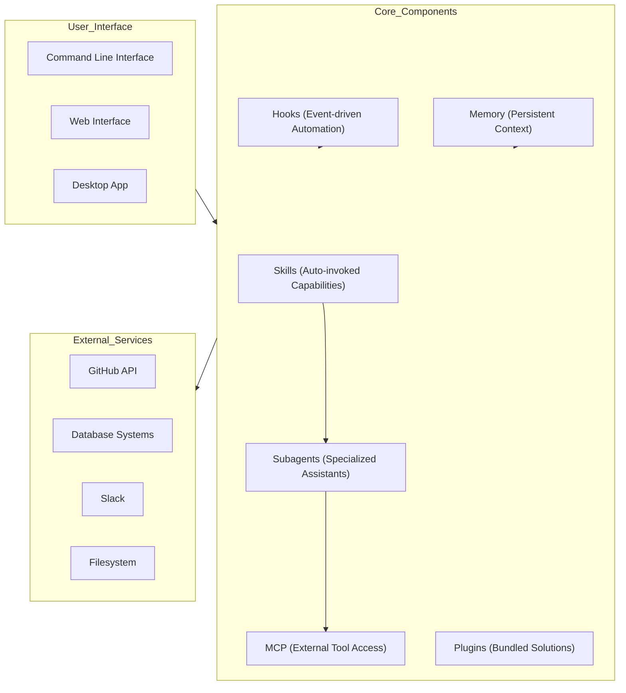

# Claude How-To: Comprehensive Code Wiki

## 1. Project Overview

**Claude How-To** is a comprehensive guide and resource repository for mastering Claude Code, Anthropic's AI coding assistant. It provides structured, visual, and example-driven tutorials to help developers leverage Claude Code's full capabilities.

### Key Objectives
- Provide a progressive learning path from beginner to advanced usage
- Offer production-ready templates and configurations
- Explain both basic and advanced features with visual diagrams
- Enable efficient workflow automation with Claude Code

### Repository Stats
- **Stars**: 21,800+
- **Forks**: 2,585+
- **Last Updated**: April 9, 2026
- **Claude Code Version**: 2.1.97
- **Compatible Models**: Claude Sonnet 4.6, Claude Opus 4.6, Claude Haiku 4.5

## 2. Architecture and Components

### System Architecture



### Component Interactions

The architecture follows a modular design where each component can be used independently or combined to create powerful workflows:

1. **Memory** provides persistent context across sessions
2. **Skills** offer reusable, auto-invoked capabilities
3. **Subagents** handle specialized tasks with isolated contexts
4. **Hooks** enable event-driven automation
5. **MCP** provides access to external tools and services
6. **Plugins** bundle multiple components for specific use cases

## 3. Key Features and Modules

### 3.1 Slash Commands

**Location**: [01-slash-commands/](file:///workspace/01-slash-commands/)

Slash commands are user-invoked shortcuts stored as Markdown files. They provide quick access to common tasks and workflows.

**Key Features**:
- Simple Markdown-based configuration
- Easy to create and share
- Can be combined with other features
- Immediate productivity boost

**Examples**:
- `optimize.md` - Code optimization analysis
- `pr.md` - Pull request preparation
- `generate-api-docs.md` - API documentation generator

**Installation**:
```bash
cp 01-slash-commands/*.md /path/to/project/.claude/commands/
```

**Usage**:
```
/optimize
/pr
/generate-api-docs
```

### 3.2 Memory

**Location**: [02-memory/](file:///workspace/02-memory/)

Memory provides persistent context across sessions through CLAUDE.md files, enabling Claude to remember project standards, preferences, and context.

**Key Features**:
- Hierarchical context loading (personal, project, directory)
- Persistent across sessions
- Automatically loaded by Claude
- Supports team-wide standards

**Types**:
- `project-CLAUDE.md` - Team-wide project standards
- `directory-api-CLAUDE.md` - Directory-specific rules
- `personal-CLAUDE.md` - Personal preferences

**Installation**:
```bash
# Project memory
cp 02-memory/project-CLAUDE.md /path/to/project/CLAUDE.md

# Directory memory
cp 02-memory/directory-api-CLAUDE.md /path/to/project/src/api/CLAUDE.md

# Personal memory
cp 02-memory/personal-CLAUDE.md ~/.claude/CLAUDE.md
```

### 3.3 Skills

**Location**: [03-skills/](file:///workspace/03-skills/)

Skills are reusable, auto-invoked capabilities with instructions and scripts. They provide specialized functionality that Claude can automatically use when relevant.

**Key Features**:
- Auto-invocation based on context
- Supports scripts and templates
- Can be personal or project-specific
- YAML frontmatter configuration

**Examples**:
- `code-review/` - Comprehensive code review with scripts
- `brand-voice/` - Brand voice consistency checker
- `doc-generator/` - API documentation generator
- `refactor/` - Code refactoring suggestions

**Installation**:
```bash
# Personal skills
cp -r 03-skills/code-review ~/.claude/skills/

# Project skills
cp -r 03-skills/code-review /path/to/project/.claude/skills/
```

### 3.4 Subagents

**Location**: [04-subagents/](file:///workspace/04-subagents/)

Subagents are specialized AI assistants with isolated contexts and custom prompts. They handle complex tasks by leveraging their domain expertise.

**Key Features**:
- Isolated context for focused work
- Specialized expertise in specific domains
- Can use tools independently
- Delegated by the main agent

**Examples**:
- `code-reviewer.md` - Comprehensive code quality analysis
- `test-engineer.md` - Test strategy and coverage
- `documentation-writer.md` - Technical documentation
- `secure-reviewer.md` - Security-focused review
- `implementation-agent.md` - Full feature implementation

**Installation**:
```bash
cp 04-subagents/*.md /path/to/project/.claude/agents/
```

### 3.5 MCP (Model Context Protocol)

**Location**: [05-mcp/](file:///workspace/05-mcp/)

MCP provides a standardized way for Claude to access external tools, APIs, and real-time data sources.

**Key Features**:
- Real-time access to external services
- Live data synchronization
- Extensible architecture
- Secure authentication
- Multiple transport protocols (HTTP, stdio)

**Supported Services**:
- GitHub (PRs, issues, repositories)
- Database (SQL queries)
- Filesystem (file operations)
- Slack (team communication)
- Google Docs (document access)

**Installation**:
```bash
# Add GitHub MCP
export GITHUB_TOKEN="your_token"
claude mcp add --transport stdio github -- npx @modelcontextprotocol/server-github
```

### 3.6 Hooks

**Location**: [06-hooks/](file:///workspace/06-hooks/)

Hooks are event-driven scripts that execute automatically in response to specific events during Claude Code sessions.

**Key Features**:
- Event-driven automation
- JSON-based input/output
- Support for command, prompt, HTTP, and agent hook types
- Pattern matching for tool-specific hooks

**Supported Events**:
- `PreToolUse` - Before tool execution
- `PostToolUse` - After tool succeeds
- `UserPromptSubmit` - When user submits a prompt
- `SessionStart` - When session begins
- `SessionEnd` - When session terminates
- And 21 more events

**Installation**:
```bash
mkdir -p ~/.claude/hooks
cp 06-hooks/*.sh ~/.claude/hooks/
chmod +x ~/.claude/hooks/*.sh
```

**Configuration Example**:
```json
{
  "hooks": {
    "PreToolUse": [
      {
        "matcher": "Bash",
        "hooks": [
          {
            "type": "command",
            "command": "python3 \"$CLAUDE_PROJECT_DIR/.claude/hooks/validate-bash.py\""
          }
        ]
      }
    ]
  }
}
```

### 3.7 Plugins

**Location**: [07-plugins/](file:///workspace/07-plugins/)

Plugins are bundled collections of commands, agents, MCP, and hooks that provide complete solutions for specific use cases.

**Key Features**:
- One-command installation
- Bundled complete solutions
- Team-wide distribution
- Customizable for specific needs

**Examples**:
- `pr-review/` - Complete PR review workflow
- `devops-automation/` - Deployment and monitoring
- `documentation/` - Documentation generation

**Installation**:
```bash
/plugin install pr-review
/plugin install devops-automation
/plugin install documentation
```

### 3.8 Checkpoints and Rewind

**Location**: [08-checkpoints/](file:///workspace/08-checkpoints/)

Checkpoints allow saving conversation state and rewinding to previous points to explore different approaches.

**Key Features**:
- Snapshot of conversation state
- Ability to rewind to previous points
- Branch points for exploring multiple approaches
- Safe experimentation

**Usage**:
```
# Checkpoints are created automatically with every user prompt
# To rewind, press Esc twice or use:
/rewind

# Then choose from five options:
# 1. Restore code and conversation
# 2. Restore conversation
# 3. Restore code
# 4. Summarize from here
# 5. Never mind
```

### 3.9 Advanced Features

**Location**: [09-advanced-features/](file:///workspace/09-advanced-features/)

Advanced features provide powerful capabilities for complex workflows and automation.

**Key Features**:
- **Planning Mode** - Create detailed implementation plans before coding
- **Extended Thinking** - Deep reasoning for complex problems
- **Background Tasks** - Run long operations without blocking
- **Permission Modes** - Fine-grained control over tool usage
- **Headless Mode** - Run Claude Code in CI/CD
- **Session Management** - Resume, rename, fork sessions
- **Agent Teams** - Multi-agent collaboration
- **Channels** - Structured multi-session workflows
- **Voice Dictation** - Hands-free interaction

**Configuration Example**:
See [config-examples.json](file:///workspace/09-advanced-features/config-examples.json)

### 3.10 CLI Reference

**Location**: [10-cli/](file:///workspace/10-cli/)

The CLI provides a complete command-line interface for Claude Code.

**Key Features**:
- Interactive mode for conversations
- Print mode for scripting and CI/CD
- JSON output for automated pipelines
- Session management and resumption
- Batch processing capabilities

**Examples**:
```bash
# Interactive mode
claude "explain this project"

# Print mode (non-interactive)
claude -p "review this code"

# Process file content
cat error.log | claude -p "explain this error"

# JSON output for scripts
claude -p --output-format json "list functions"

# Resume session
claude -r "feature-auth" "continue implementation"
```

## 4. Core Concepts and Workflows

### 4.1 Learning Path

The project follows a structured learning path based on three key principles:
1. **Dependencies** - Foundational concepts come first
2. **Complexity** - Easier features before advanced ones
3. **Frequency of Use** - Most common features taught early

**Learning Levels**:
- **Level 1 (Beginner)**: Slash Commands, Memory, Checkpoints, CLI Basics
- **Level 2 (Intermediate)**: Skills, Hooks, MCP, Subagents
- **Level 3 (Advanced)**: Advanced Features, Plugins, CLI Mastery

### 4.2 Workflow Examples

#### Complete Code Review Workflow
```markdown
# Uses: Slash Commands + Subagents + Memory + MCP

User: /review-pr

Claude:
1. Loads project memory (coding standards)
2. Fetches PR via GitHub MCP
3. Delegates to code-reviewer subagent
4. Delegates to test-engineer subagent
5. Synthesizes findings
6. Provides comprehensive review
```

#### Automated Documentation
```markdown
# Uses: Skills + Subagents + Memory

User: "Generate API documentation for the auth module"

Claude:
1. Loads project memory (doc standards)
2. Detects doc generation request
3. Auto-invokes doc-generator skill
4. Delegates to api-documenter subagent
5. Creates comprehensive docs with examples
```

#### DevOps Deployment
```markdown
# Uses: Plugins + MCP + Hooks

User: /deploy production

Claude:
1. Runs pre-deploy hook (validates environment)
2. Delegates to deployment-specialist subagent
3. Executes deployment via Kubernetes MCP
4. Monitors progress
5. Runs post-deploy hook (health checks)
6. Reports status
```

### 4.3 Feature Comparison

| Feature | Invocation | Persistence | Best For |
|---------|-----------|------------|----------|
| **Slash Commands** | Manual (`/cmd`) | Session only | Quick shortcuts |
| **Memory** | Auto-loaded | Cross-session | Long-term learning |
| **Skills** | Auto-invoked | Filesystem | Automated workflows |
| **Subagents** | Auto-delegated | Isolated context | Task distribution |
| **MCP Protocol** | Auto-queried | Real-time | Live data access |
| **Hooks** | Event-triggered | Configured | Automation & validation |
| **Plugins** | One command | All features | Complete solutions |
| **Checkpoints** | Manual/Auto | Session-based | Safe experimentation |
| **Planning Mode** | Manual/Auto | Plan phase | Complex implementations |
| **Background Tasks** | Manual | Task duration | Long-running operations |
| **CLI Reference** | Terminal commands | Session/Script | Automation & scripting |

## 5. Installation and Usage

### 5.1 Quick Start (15 Minutes)

```bash
# 1. Clone the guide
git clone https://github.com/luongnv89/claude-howto.git
cd claude-howto

# 2. Copy your first slash command
mkdir -p /path/to/your-project/.claude/commands
cp 01-slash-commands/optimize.md /path/to/your-project/.claude/commands/

# 3. Try it — in Claude Code, type:
# /optimize

# 4. Ready for more? Set up project memory:
cp 02-memory/project-CLAUDE.md /path/to/your-project/CLAUDE.md

# 5. Install a skill:
cp -r 03-skills/code-review ~/.claude/skills/
```

### 5.2 Essential Setup (1 Hour)

```bash
# Slash commands (15 min)
cp 01-slash-commands/*.md .claude/commands/

# Project memory (15 min)
cp 02-memory/project-CLAUDE.md ./CLAUDE.md

# Install a skill (15 min)
cp -r 03-skills/code-review ~/.claude/skills/

# Weekend goal: add hooks, subagents, MCP, and plugins
# Follow the learning path for guided setup
```

### 5.3 Complete Installation

**Slash Commands**:
```bash
cp 01-slash-commands/*.md .claude/commands/
```

**Memory**:
```bash
cp 02-memory/project-CLAUDE.md ./CLAUDE.md
```

**Skills**:
```bash
cp -r 03-skills/code-review ~/.claude/skills/
```

**Subagents**:
```bash
cp 04-subagents/*.md .claude/agents/
```

**MCP**:
```bash
export GITHUB_TOKEN="token"
claude mcp add github -- npx -y @modelcontextprotocol/server-github
```

**Hooks**:
```bash
mkdir -p ~/.claude/hooks
cp 06-hooks/*.sh ~/.claude/hooks/
chmod +x ~/.claude/hooks/*.sh
```

**Plugins**:
```bash
/plugin install pr-review
```

## 6. Extensibility and Integration

### 6.1 Creating Custom Components

**Custom Slash Commands**:
1. Create a Markdown file in `.claude/commands/`
2. Add YAML frontmatter with name and description
3. Write the command instructions in Markdown

**Custom Skills**:
1. Create a directory in `~/.claude/skills/`
2. Add a `SKILL.md` file with YAML frontmatter
3. Include scripts and templates as needed

**Custom Subagents**:
1. Create a Markdown file in `.claude/agents/`
2. Add YAML frontmatter with name, description, and tools
3. Write the agent instructions and guidelines

**Custom Hooks**:
1. Create a script in `~/.claude/hooks/`
2. Configure it in `~/.claude/settings.json`
3. Test with sample JSON input

### 6.2 Integration with CI/CD

**CLI in CI/CD**:
```bash
# Run tests and generate report
claude -p "Run all tests and generate report"

# JSON output for automation
claude -p --output-format json "review code"

# Process changed files
for file in $(git diff --name-only HEAD~1); do
  claude -p "Review this file: $(cat $file)" > ${file}.review
 done
```

**GitHub Actions Example**:
```yaml
name: Claude Code Review
on: [pull_request]
jobs:
  review:
    runs-on: ubuntu-latest
    steps:
      - uses: actions/checkout@v3
      - name: Review code
        run: |
          echo "${{ github.event.pull_request.diff_url }}" | claude -p "Review this PR diff"
```

## 7. Best Practices and Guidelines

### 7.1 Do's

- Start simple with slash commands
- Add features incrementally
- Use memory for team standards
- Test configurations locally first
- Document custom implementations
- Version control project configurations
- Share plugins with team
- Use environment variables for secrets
- Follow security best practices

### 7.2 Don'ts

- Don't create redundant features
- Don't hardcode credentials
- Don't skip documentation
- Don't over-complicate simple tasks
- Don't ignore security best practices
- Don't commit sensitive data
- Don't use personal tokens for team projects
- Don't grant unnecessary permissions

### 7.3 Security Considerations

- Use environment variables for all credentials
- Rotate tokens and API keys regularly (monthly recommended)
- Use read-only tokens when possible
- Limit MCP server access scope to minimum required
- Monitor MCP server usage and access logs
- Use OAuth for external services when available
- Implement rate limiting on MCP requests
- Test MCP connections before production use
- Document all active MCP connections
- Keep MCP server packages updated

## 8. Testing and Quality Assurance

### 8.1 Automated Testing

The project includes comprehensive automated testing:

- **Unit Tests**: Python tests using pytest (Python 3.10, 3.11, 3.12)
- **Code Quality**: Linting and formatting with Ruff
- **Security**: Vulnerability scanning with Bandit
- **Type Checking**: Static type analysis with mypy
- **Build Verification**: EPUB generation testing
- **Coverage Tracking**: Codecov integration

**Running Tests**:
```bash
# Install development dependencies
uv pip install -r requirements-dev.txt

# Run all unit tests
pytest scripts/tests/ -v

# Run tests with coverage report
pytest scripts/tests/ -v --cov=scripts --cov-report=html

# Run code quality checks
ruff check scripts/
ruff format --check scripts/

# Run security scan
bandit -c pyproject.toml -r scripts/ --exclude scripts/tests/

# Run type checking
mypy scripts/ --ignore-missing-imports
```

### 8.2 EPUB Generation

Generate an EPUB ebook for offline reading:

```bash
uv run scripts/build_epub.py
```

This creates `claude-howto-guide.epub` with all content, including rendered Mermaid diagrams.

## 9. Troubleshooting

### 9.1 Common Issues

**Feature Not Loading**
1. Check file location and naming
2. Verify YAML frontmatter syntax
3. Check file permissions
4. Review Claude Code version compatibility

**MCP Connection Failed**
1. Verify environment variables
2. Check MCP server installation
3. Test credentials
4. Review network connectivity

**Subagent Not Delegating**
1. Check tool permissions
2. Verify agent description clarity
3. Review task complexity
4. Test agent independently

**Hook Not Executing**
1. Verify JSON configuration syntax
2. Check matcher pattern matches the tool name
3. Ensure script exists and is executable
4. Run `claude --debug` to see hook execution logs

## 10. Additional Resources

### 10.1 Official Documentation
- [Claude Code Documentation](https://code.claude.com/docs/en/overview)
- [Anthropic Documentation](https://docs.anthropic.com)
- [MCP Protocol Specification](https://modelcontextprotocol.io)

### 10.2 Community Resources
- [Anthropic Cookbook](https://github.com/anthropics/anthropic-cookbook)
- [MCP Servers Repository](https://github.com/modelcontextprotocol/servers)
- [Skills Repository](https://github.com/luongnv89/skills)

### 10.3 Related Blog Posts
- [Discovering Claude Code Slash Commands](https://medium.com/@luongnv89/discovering-claude-code-slash-commands-cdc17f0dfb29)
- [Code Execution with MCP: Building More Efficient Agents](https://www.anthropic.com/engineering/code-execution-with-mcp)

## 11. Conclusion

Claude How-To provides a comprehensive, structured approach to mastering Claude Code. By following the learning path and leveraging the provided templates and examples, developers can quickly become proficient in using Claude Code to automate workflows, improve code quality, and increase productivity.

The project's modular design allows users to start with basic features and gradually incorporate more advanced capabilities as they become comfortable. With its extensive documentation, visual diagrams, and production-ready templates, Claude How-To serves as an invaluable resource for both beginners and experienced users looking to maximize their use of Claude Code.

---

**Last Updated**: April 9, 2026
**Claude Code Version**: 2.1.97
**Compatible Models**: Claude Sonnet 4.6, Claude Opus 4.6, Claude Haiku 4.5
**License**: MIT License - free to use, modify, and distribute
