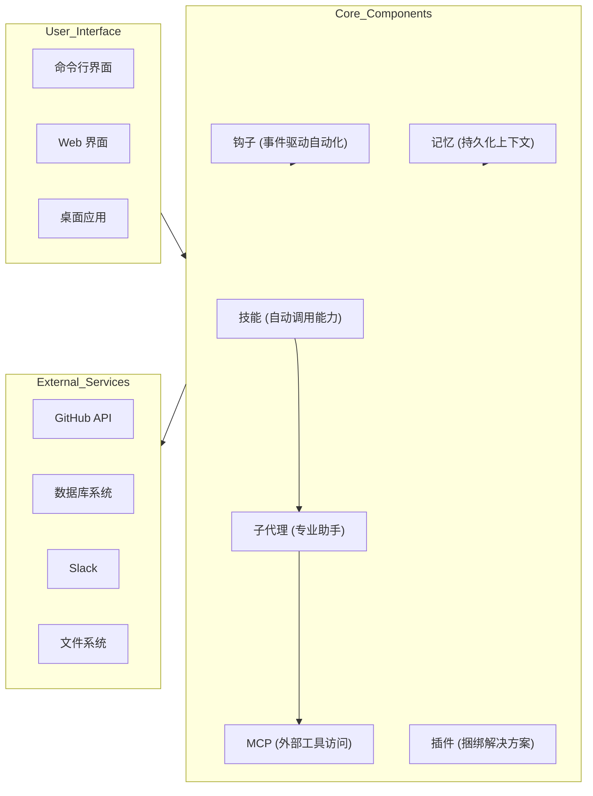

# Claude How-To: 综合代码百科

## 1. 项目概述

**Claude How-To** 是一个全面的指南和资源库，用于掌握 Anthropic 的 AI 编码助手 Claude Code。它提供结构化、可视化和示例驱动的教程，帮助开发者充分利用 Claude Code 的全部功能。

### 核心目标
- 提供从初级到高级使用的渐进式学习路径
- 提供生产就绪的模板和配置
- 通过可视化图表解释基本和高级功能
- 实现 Claude Code 的高效工作流自动化

### 仓库统计
- **星标数**: 21,800+
- **分叉数**: 2,585+
- **最后更新**: 2026年4月9日
- **Claude Code 版本**: 2.1.97
- **兼容模型**: Claude Sonnet 4.6, Claude Opus 4.6, Claude Haiku 4.5

## 2. 架构与组件

### 系统架构



### 组件交互

架构采用模块化设计，每个组件可以独立使用或组合使用以创建强大的工作流：

1. **记忆** 提供跨会话的持久化上下文
2. **技能** 提供可重用的自动调用能力
3. **子代理** 处理具有隔离上下文的专业任务
4. **钩子** 实现事件驱动的自动化
5. **MCP** 提供对外部工具和服务的访问
6. **插件** 为特定用例捆绑多个组件

## 3. 核心功能和模块

### 3.1 斜杠命令

**位置**: [01-slash-commands/](file:///workspace/01-slash-commands/)

斜杠命令是存储为 Markdown 文件的用户调用快捷方式。它们提供对常见任务和工作流的快速访问。

**核心功能**:
- 基于 Markdown 的简单配置
- 易于创建和分享
- 可以与其他功能组合使用
- 立即提升生产力

**示例**:
- `optimize.md` - 代码优化分析
- `pr.md` - 拉取请求准备
- `generate-api-docs.md` - API 文档生成器

**安装**:
```bash
cp 01-slash-commands/*.md /path/to/project/.claude/commands/
```

**使用**:
```
/optimize
/pr
/generate-api-docs
```

### 3.2 记忆

**位置**: [02-memory/](file:///workspace/02-memory/)

记忆通过 CLAUDE.md 文件提供跨会话的持久化上下文，使 Claude 能够记住项目标准、偏好和上下文。

**核心功能**:
- 分层上下文加载（个人、项目、目录）
- 跨会话持久化
- 由 Claude 自动加载
- 支持团队范围的标准

**类型**:
- `project-CLAUDE.md` - 团队范围的项目标准
- `directory-api-CLAUDE.md` - 目录特定规则
- `personal-CLAUDE.md` - 个人偏好

**安装**:
```bash
# 项目记忆
cp 02-memory/project-CLAUDE.md /path/to/project/CLAUDE.md

# 目录记忆
cp 02-memory/directory-api-CLAUDE.md /path/to/project/src/api/CLAUDE.md

# 个人记忆
cp 02-memory/personal-CLAUDE.md ~/.claude/CLAUDE.md
```

### 3.3 技能

**位置**: [03-skills/](file:///workspace/03-skills/)

技能是带有指令和脚本的可重用、自动调用能力。它们提供 Claude 可以在相关时自动使用的专业功能。

**核心功能**:
- 基于上下文的自动调用
- 支持脚本和模板
- 可以是个人或项目特定的
- YAML 前置配置

**示例**:
- `code-review/` - 带有脚本的综合代码审查
- `brand-voice/` - 品牌声音一致性检查器
- `doc-generator/` - API 文档生成器
- `refactor/` - 代码重构建议

**安装**:
```bash
# 个人技能
cp -r 03-skills/code-review ~/.claude/skills/

# 项目技能
cp -r 03-skills/code-review /path/to/project/.claude/skills/
```

### 3.4 子代理

**位置**: [04-subagents/](file:///workspace/04-subagents/)

子代理是具有隔离上下文和自定义提示的专业 AI 助手。它们通过利用其领域专业知识来处理复杂任务。

**核心功能**:
- 用于专注工作的隔离上下文
- 特定领域的专业知识
- 可以独立使用工具
- 由主代理委派

**示例**:
- `code-reviewer.md` - 综合代码质量分析
- `test-engineer.md` - 测试策略和覆盖范围
- `documentation-writer.md` - 技术文档
- `secure-reviewer.md` - 安全重点审查
- `implementation-agent.md` - 完整功能实现

**安装**:
```bash
cp 04-subagents/*.md /path/to/project/.claude/agents/
```

### 3.5 MCP (模型上下文协议)

**位置**: [05-mcp/](file:///workspace/05-mcp/)

MCP 为 Claude 提供了访问外部工具、API 和实时数据源的标准化方式。

**核心功能**:
- 实时访问外部服务
- 实时数据同步
- 可扩展架构
- 安全认证
- 多种传输协议（HTTP、stdio）

**支持的服务**:
- GitHub（PR、问题、仓库）
- 数据库（SQL 查询）
- 文件系统（文件操作）
- Slack（团队通信）
- Google Docs（文档访问）

**安装**:
```bash
# 添加 GitHub MCP
export GITHUB_TOKEN="your_token"
claude mcp add --transport stdio github -- npx @modelcontextprotocol/server-github
```

### 3.6 钩子

**位置**: [06-hooks/](file:///workspace/06-hooks/)

钩子是在 Claude Code 会话期间响应特定事件自动执行的事件驱动脚本。

**核心功能**:
- 事件驱动自动化
- 基于 JSON 的输入/输出
- 支持命令、提示、HTTP 和代理钩子类型
- 工具特定钩子的模式匹配

**支持的事件**:
- `PreToolUse` - 工具执行前
- `PostToolUse` - 工具成功后
- `UserPromptSubmit` - 用户提交提示时
- `SessionStart` - 会话开始时
- `SessionEnd` - 会话终止时
- 以及其他 21 个事件

**安装**:
```bash
mkdir -p ~/.claude/hooks
cp 06-hooks/*.sh ~/.claude/hooks/
chmod +x ~/.claude/hooks/*.sh
```

**配置示例**:
```json
{
  "hooks": {
    "PreToolUse": [
      {
        "matcher": "Bash",
        "hooks": [
          {
            "type": "command",
            "command": "python3 \"$CLAUDE_PROJECT_DIR/.claude/hooks/validate-bash.py\""
          }
        ]
      }
    ]
  }
}
```

### 3.7 插件

**位置**: [07-plugins/](file:///workspace/07-plugins/)

插件是命令、代理、MCP 和钩子的捆绑集合，为特定用例提供完整解决方案。

**核心功能**:
- 一键安装
- 捆绑完整解决方案
- 团队范围分发
- 可针对特定需求定制

**示例**:
- `pr-review/` - 完整的 PR 审查工作流
- `devops-automation/` - 部署和监控
- `documentation/` - 文档生成

**安装**:
```bash
/plugin install pr-review
/plugin install devops-automation
/plugin install documentation
```

### 3.8 检查点和回退

**位置**: [08-checkpoints/](file:///workspace/08-checkpoints/)

检查点允许保存对话状态并回退到之前的点以探索不同的方法。

**核心功能**:
- 对话状态快照
- 回退到之前点的能力
- 探索多种方法的分支点
- 安全实验

**使用**:
```
# 检查点会在每次用户提示时自动创建
# 要回退，请按两次 Esc 或使用：
/rewind

# 然后从五个选项中选择：
# 1. 恢复代码和对话
# 2. 恢复对话
# 3. 恢复代码
# 4. 从此处总结
# 5. 取消
```

### 3.9 高级功能

**位置**: [09-advanced-features/](file:///workspace/09-advanced-features/)

高级功能为复杂工作流和自动化提供强大的能力。

**核心功能**:
- **规划模式** - 在编码前创建详细的实现计划
- **扩展思考** - 复杂问题的深度推理
- **后台任务** - 运行长时间操作而不阻塞
- **权限模式** - 对工具使用的细粒度控制
- **无头模式** - 在 CI/CD 中运行 Claude Code
- **会话管理** - 恢复、重命名、分叉会话
- **代理团队** - 多代理协作
- **频道** - 结构化多会话工作流
- **语音听写** - 免手操作

**配置示例**:
参见 [config-examples.json](file:///workspace/09-advanced-features/config-examples.json)

### 3.10 CLI 参考

**位置**: [10-cli/](file:///workspace/10-cli/)

CLI 为 Claude Code 提供完整的命令行界面。

**核心功能**:
- 用于对话的交互模式
- 用于脚本和 CI/CD 的打印模式
- 用于自动管道的 JSON 输出
- 会话管理和恢复
- 批处理能力

**示例**:
```bash
# 交互模式
claude "explain this project"

# 打印模式（非交互）
claude -p "review this code"

# 处理文件内容
cat error.log | claude -p "explain this error"

# 脚本的 JSON 输出
claude -p --output-format json "list functions"

# 恢复会话
claude -r "feature-auth" "continue implementation"
```

## 4. 核心概念和工作流

### 4.1 学习路径

项目遵循基于三个关键原则的结构化学习路径：
1. **依赖关系** - 基础概念先行
2. **复杂度** - 先易后难
3. **使用频率** - 最常见的功能优先教授

**学习级别**:
- **级别 1（初级）**：斜杠命令、记忆、检查点、CLI 基础
- **级别 2（中级）**：技能、钩子、MCP、子代理
- **级别 3（高级）**：高级功能、插件、CLI 精通

### 4.2 工作流示例

#### 完整代码审查工作流
```markdown
# 使用：斜杠命令 + 子代理 + 记忆 + MCP

用户：/review-pr

Claude：
1. 加载项目记忆（编码标准）
2. 通过 GitHub MCP 获取 PR
3. 委派给代码审查子代理
4. 委派给测试工程师子代理
5. 综合发现
6. 提供全面审查
```

#### 自动文档生成
```markdown
# 使用：技能 + 子代理 + 记忆

用户："为 auth 模块生成 API 文档"

Claude：
1. 加载项目记忆（文档标准）
2. 检测文档生成请求
3. 自动调用文档生成器技能
4. 委派给 API 文档编写子代理
5. 创建带示例的综合文档
```

#### DevOps 部署
```markdown
# 使用：插件 + MCP + 钩子

用户：/deploy production

Claude：
1. 运行部署前钩子（验证环境）
2. 委派给部署专家子代理
3. 通过 Kubernetes MCP 执行部署
4. 监控进度
5. 运行部署后钩子（健康检查）
6. 报告状态
```

### 4.3 功能比较

| 功能 | 调用方式 | 持久性 | 最适合 |
|---------|-----------|------------|----------|
| **斜杠命令** | 手动 (`/cmd`) | 仅会话 | 快速快捷方式 |
| **记忆** | 自动加载 | 跨会话 | 长期学习 |
| **技能** | 自动调用 | 文件系统 | 自动化工作流 |
| **子代理** | 自动委派 | 隔离上下文 | 任务分配 |
| **MCP 协议** | 自动查询 | 实时 | 实时数据访问 |
| **钩子** | 事件触发 | 已配置 | 自动化和验证 |
| **插件** | 一个命令 | 所有功能 | 完整解决方案 |
| **检查点** | 手动/自动 | 基于会话 | 安全实验 |
| **规划模式** | 手动/自动 | 计划阶段 | 复杂实现 |
| **后台任务** | 手动 | 任务持续时间 | 长时间运行的操作 |
| **CLI 参考** | 终端命令 | 会话/脚本 | 自动化和脚本 |

## 5. 安装和使用

### 5.1 快速开始（15 分钟）

```bash
# 1. 克隆指南
git clone https://github.com/luongnv89/claude-howto.git
cd claude-howto

# 2. 复制您的第一个斜杠命令
mkdir -p /path/to/your-project/.claude/commands
cp 01-slash-commands/optimize.md /path/to/your-project/.claude/commands/

# 3. 尝试一下 — 在 Claude Code 中，输入：
# /optimize

# 4. 准备好更多了吗？设置项目记忆：
cp 02-memory/project-CLAUDE.md /path/to/your-project/CLAUDE.md

# 5. 安装技能：
cp -r 03-skills/code-review ~/.claude/skills/
```

### 5.2 基本设置（1 小时）

```bash
# 斜杠命令（15 分钟）
cp 01-slash-commands/*.md .claude/commands/

# 项目记忆（15 分钟）
cp 02-memory/project-CLAUDE.md ./CLAUDE.md

# 安装技能（15 分钟）
cp -r 03-skills/code-review ~/.claude/skills/

# 周末目标：添加钩子、子代理、MCP 和插件
# 按照学习路径进行指导设置
```

### 5.3 完整安装

**斜杠命令**:
```bash
cp 01-slash-commands/*.md .claude/commands/
```

**记忆**:
```bash
cp 02-memory/project-CLAUDE.md ./CLAUDE.md
```

**技能**:
```bash
cp -r 03-skills/code-review ~/.claude/skills/
```

**子代理**:
```bash
cp 04-subagents/*.md .claude/agents/
```

**MCP**:
```bash
export GITHUB_TOKEN="token"
claude mcp add github -- npx -y @modelcontextprotocol/server-github
```

**钩子**:
```bash
mkdir -p ~/.claude/hooks
cp 06-hooks/*.sh ~/.claude/hooks/
chmod +x ~/.claude/hooks/*.sh
```

**插件**:
```bash
/plugin install pr-review
```

## 6. 可扩展性和集成

### 6.1 创建自定义组件

**自定义斜杠命令**:
1. 在 `.claude/commands/` 中创建 Markdown 文件
2. 添加带有名称和描述的 YAML 前置
3. 在 Markdown 中编写命令指令

**自定义技能**:
1. 在 `~/.claude/skills/` 中创建目录
2. 添加带有 YAML 前置的 `SKILL.md` 文件
3. 根据需要包含脚本和模板

**自定义子代理**:
1. 在 `.claude/agents/` 中创建 Markdown 文件
2. 添加带有名称、描述和工具的 YAML 前置
3. 编写代理指令和指南

**自定义钩子**:
1. 在 `~/.claude/hooks/` 中创建脚本
2. 在 `~/.claude/settings.json` 中配置它
3. 用示例 JSON 输入测试

### 6.2 与 CI/CD 集成

**CI/CD 中的 CLI**:
```bash
# 运行测试并生成报告
claude -p "Run all tests and generate report"

# 自动化的 JSON 输出
claude -p --output-format json "review code"

# 处理更改的文件
for file in $(git diff --name-only HEAD~1); do
  claude -p "Review this file: $(cat $file)" > ${file}.review
 done
```

**GitHub Actions 示例**:
```yaml
name: Claude Code Review
on: [pull_request]
jobs:
  review:
    runs-on: ubuntu-latest
    steps:
      - uses: actions/checkout@v3
      - name: Review code
        run: |
          echo "${{ github.event.pull_request.diff_url }}" | claude -p "Review this PR diff"
```

## 7. 最佳实践和指南

### 7.1 建议

- 从简单的斜杠命令开始
- 逐步添加功能
- 使用记忆存储团队标准
- 首先在本地测试配置
- 记录自定义实现
- 版本控制项目配置
- 与团队共享插件
- 使用环境变量存储密钥
- 遵循安全最佳实践

### 7.2 不建议

- 不要创建冗余功能
- 不要硬编码凭证
- 不要跳过文档
- 不要过度复杂化简单任务
- 不要忽视安全最佳实践
- 不要提交敏感数据
- 不要为团队项目使用个人令牌
- 不要授予不必要的权限

### 7.3 安全考虑

- 对所有凭证使用环境变量
- 定期轮换令牌和 API 密钥（建议每月）
- 尽可能使用只读令牌
- 将 MCP 服务器访问范围限制为最小必要
- 监控 MCP 服务器使用和访问日志
- 尽可能对外部服务使用 OAuth
- 对 MCP 请求实施速率限制
- 在生产使用前测试 MCP 连接
- 记录所有活动的 MCP 连接
- 保持 MCP 服务器包更新

## 8. 测试和质量保证

### 8.1 自动化测试

项目包括全面的自动化测试：

- **单元测试**：使用 pytest 的 Python 测试（Python 3.10, 3.11, 3.12）
- **代码质量**：使用 Ruff 进行 linting 和格式化
- **安全**：使用 Bandit 进行漏洞扫描
- **类型检查**：使用 mypy 进行静态类型分析
- **构建验证**：EPUB 生成测试
- **覆盖率跟踪**：Codecov 集成

**运行测试**:
```bash
# 安装开发依赖
uv pip install -r requirements-dev.txt

# 运行所有单元测试
pytest scripts/tests/ -v

# 运行带有覆盖率报告的测试
pytest scripts/tests/ -v --cov=scripts --cov-report=html

# 运行代码质量检查
ruff check scripts/
ruff format --check scripts/

# 运行安全扫描
bandit -c pyproject.toml -r scripts/ --exclude scripts/tests/

# 运行类型检查
mypy scripts/ --ignore-missing-imports
```

### 8.2 EPUB 生成

生成 EPUB 电子书以供离线阅读：

```bash
uv run scripts/build_epub.py
```

这会创建 `claude-howto-guide.epub`，包含所有内容，包括渲染的 Mermaid 图表。

## 9. 故障排除

### 9.1 常见问题

**功能未加载**
1. 检查文件位置和命名
2. 验证 YAML 前置语法
3. 检查文件权限
4. 检查 Claude Code 版本兼容性

**MCP 连接失败**
1. 验证环境变量
2. 检查 MCP 服务器安装
3. 测试凭证
4. 检查网络连接

**子代理未委派**
1. 检查工具权限
2. 验证代理描述清晰度
3. 检查任务复杂性
4. 独立测试代理

**钩子未执行**
1. 验证 JSON 配置语法
2. 检查匹配器模式是否匹配工具名称
3. 确保脚本存在且可执行
4. 运行 `claude --debug` 查看钩子执行日志

## 10. 其他资源

### 10.1 官方文档
- [Claude Code 文档](https://code.claude.com/docs/en/overview)
- [Anthropic 文档](https://docs.anthropic.com)
- [MCP 协议规范](https://modelcontextprotocol.io)

### 10.2 社区资源
- [Anthropic Cookbook](https://github.com/anthropics/anthropic-cookbook)
- [MCP 服务器仓库](https://github.com/modelcontextprotocol/servers)
- [技能仓库](https://github.com/luongnv89/skills)

### 10.3 相关博客文章
- [发现 Claude Code 斜杠命令](https://medium.com/@luongnv89/discovering-claude-code-slash-commands-cdc17f0dfb29)
- [使用 MCP 执行代码：构建更高效的代理](https://www.anthropic.com/engineering/code-execution-with-mcp)

## 11. 结论

Claude How-To 提供了掌握 Claude Code 的全面、结构化方法。通过遵循学习路径并利用提供的模板和示例，开发人员可以快速熟练使用 Claude Code 来自动化工作流、提高代码质量并提高生产力。

项目的模块化设计允许用户从基本功能开始，随着舒适度的提高逐渐整合更高级的功能。凭借其广泛的文档、可视化图表和生产就绪的模板，Claude How-To 成为初学者和经验丰富的用户寻求最大化 Claude Code 使用的宝贵资源。

---

**最后更新**：2026年4月9日
**Claude Code 版本**：2.1.97
**兼容模型**：Claude Sonnet 4.6, Claude Opus 4.6, Claude Haiku 4.5
**许可证**：MIT 许可证 - 免费使用、修改和分发
